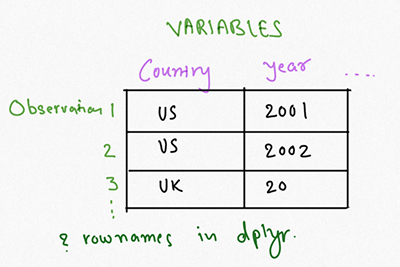
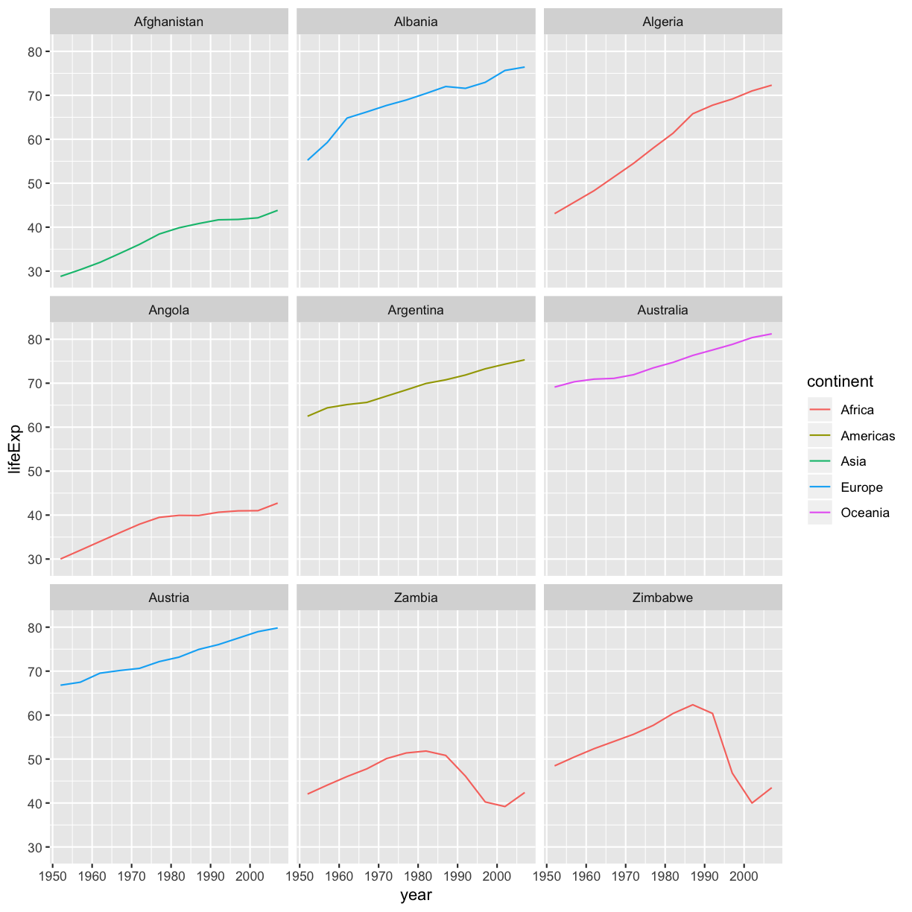

---
# Please do not edit this file directly; it is auto generated.
# Instead, please edit 13-dplyr.md in _episodes_rmd/
title: "Dataframe Manipulation with dplyr"
keypoints:
- Use the `dplyr` package to manipulate dataframes.
- Use `select()` to choose variables from a dataframe.
- Use `filter()` to choose data based on values.
- Use `group_by()` and `summarize()` to work with subsets of data.
- Use `mutate()` to create new variables.
- use `arrange()` to arrange rows.
objectives:
- ' To be able to use the six main dataframe manipulation ''verbs'' with pipes in  `dplyr`.'
- ' To understand how `group_by()` and `summarize()` can be combined to summarize
  datasets.'
- ' Be able to analyze a subset of data using logical filtering.'
questions: How can I manipulate dataframes without repeating myself?
source: Rmd
teaching: 40
exercises: 15
---

Manipulation of dataframes means many things to many researchers, we often
select certain observations (rows) or variables (columns), we often group the
data by a certain variable(s), or we even calculate summary statistics. We can
do these operations using the normal base R operations:

~~~
mean(gapminder[gapminder$continent == "Africa", "gdpPercap"])
~~~
{: .language-r}

~~~
[1] 2193.755
~~~
{: .output}

~~~
mean(gapminder[gapminder$continent == "Americas", "gdpPercap"])
~~~
{: .language-r}

~~~
[1] 7136.11
~~~
{: .output}

~~~
mean(gapminder[gapminder$continent == "Asia", "gdpPercap"])
~~~
{: .language-r}

~~~
[1] 7902.15
~~~
{: .output}

But this isn't very *nice* because there is a fair bit of repetition. Repeating
yourself will cost you time, both now and later, and potentially introduce some
nasty bugs.

## The `dplyr` package

Luckily, the [`dplyr`](https://cran.r-project.org/web/packages/dplyr/dplyr.pdf)
package provides a number of very useful functions for manipulating dataframes
in a way that will reduce the above repetition, reduce the probability of making
errors, and probably even save you some typing. As an added bonus, you might
even find the `dplyr` **grammar easier to read**.

Here we're going to cover 6 of the most commonly used functions as well as using
pipes (`%>%`) to combine them.

1. `select()`
2. `filter()`
3. `group_by()`
4. `summarize()`
5. `mutate()`
6. `arrange()`

If you have have not installed this package earlier, please do so by installing dplyr package or an umbrella package, tidyverse.

~~~
install.packages('dplyr')
~~~
{: .language-r}

~~~
Installing package into '/Users/samin1/Library/R/3.4/library'
(as 'lib' is unspecified)
~~~
{: .output}

~~~

The downloaded binary packages are in
	/var/folders/kq/hcddsvts08jcc5jplx58b4bm0000gq/T//RtmpnuRJrH/downloaded_packages
~~~
{: .output}

~~~
## alternately install tidyverse package
install.package("tidyverse")
~~~
{: .language-r}

~~~
Error in install.package("tidyverse"): could not find function "install.package"
~~~
{: .error}

Now let's load the package:

~~~
library("dplyr")
~~~
{: .language-r}

### Key assumptions of dplyr package

* Each row contains an observation
* Each column contains a variable or a feature for the observation
* Query by rownames are discouraged
  * Details under resource section at the end

### Before we begin...

Let's convert data.frame to tibble format.

Tibble is a new and dplyr-friendly version of data frame. Unlike data frame, tibble format is more robust and less prone for common errors, e.g., tibble format is more expressive in showing warnings and avoid common mistakes while manipulating data frames in R.

~~~
#### what is data.frame? ####

## It is a named list
typeof(gapminder)
~~~
{: .language-r}

~~~
[1] "list"
~~~
{: .output}

~~~
## with a class: data.frame
class(gapminder)
~~~
{: .language-r}

~~~
[1] "data.frame"
~~~
{: .output}

~~~
## of vectors (columns) of equal length.
attributes(gapminder)
~~~
{: .language-r}

~~~
$names
[1] "country"   "year"      "pop"       "continent" "lifeExp"   "gdpPercap"

$class
[1] "data.frame"

$row.names
   [1]    1    2    3    4    5    6    7    8    9   10   11   12   13
  [14]   14   15   16   17   18   19   20   21   22   23   24   25   26
  [27]   27   28   29   30   31   32   33   34   35   36   37   38   39
  [40]   40   41   42   43   44   45   46   47   48   49   50   51   52
  [53]   53   54   55   56   57   58   59   60   61   62   63   64   65
  [66]   66   67   68   69   70   71   72   73   74   75   76   77   78
  [79]   79   80   81   82   83   84   85   86   87   88   89   90   91
  [92]   92   93   94   95   96   97   98   99  100  101  102  103  104
 [105]  105  106  107  108  109  110  111  112  113  114  115  116  117
 [118]  118  119  120  121  122  123  124  125  126  127  128  129  130
 [131]  131  132  133  134  135  136  137  138  139  140  141  142  143
 [144]  144  145  146  147  148  149  150  151  152  153  154  155  156
 [157]  157  158  159  160  161  162  163  164  165  166  167  168  169
 [170]  170  171  172  173  174  175  176  177  178  179  180  181  182
 [183]  183  184  185  186  187  188  189  190  191  192  193  194  195
 [196]  196  197  198  199  200  201  202  203  204  205  206  207  208
 [209]  209  210  211  212  213  214  215  216  217  218  219  220  221
 [222]  222  223  224  225  226  227  228  229  230  231  232  233  234
 [235]  235  236  237  238  239  240  241  242  243  244  245  246  247
 [248]  248  249  250  251  252  253  254  255  256  257  258  259  260
 [261]  261  262  263  264  265  266  267  268  269  270  271  272  273
 [274]  274  275  276  277  278  279  280  281  282  283  284  285  286
 [287]  287  288  289  290  291  292  293  294  295  296  297  298  299
 [300]  300  301  302  303  304  305  306  307  308  309  310  311  312
 [313]  313  314  315  316  317  318  319  320  321  322  323  324  325
 [326]  326  327  328  329  330  331  332  333  334  335  336  337  338
 [339]  339  340  341  342  343  344  345  346  347  348  349  350  351
 [352]  352  353  354  355  356  357  358  359  360  361  362  363  364
 [365]  365  366  367  368  369  370  371  372  373  374  375  376  377
 [378]  378  379  380  381  382  383  384  385  386  387  388  389  390
 [391]  391  392  393  394  395  396  397  398  399  400  401  402  403
 [404]  404  405  406  407  408  409  410  411  412  413  414  415  416
 [417]  417  418  419  420  421  422  423  424  425  426  427  428  429
 [430]  430  431  432  433  434  435  436  437  438  439  440  441  442
 [443]  443  444  445  446  447  448  449  450  451  452  453  454  455
 [456]  456  457  458  459  460  461  462  463  464  465  466  467  468
 [469]  469  470  471  472  473  474  475  476  477  478  479  480  481
 [482]  482  483  484  485  486  487  488  489  490  491  492  493  494
 [495]  495  496  497  498  499  500  501  502  503  504  505  506  507
 [508]  508  509  510  511  512  513  514  515  516  517  518  519  520
 [521]  521  522  523  524  525  526  527  528  529  530  531  532  533
 [534]  534  535  536  537  538  539  540  541  542  543  544  545  546
 [547]  547  548  549  550  551  552  553  554  555  556  557  558  559
 [560]  560  561  562  563  564  565  566  567  568  569  570  571  572
 [573]  573  574  575  576  577  578  579  580  581  582  583  584  585
 [586]  586  587  588  589  590  591  592  593  594  595  596  597  598
 [599]  599  600  601  602  603  604  605  606  607  608  609  610  611
 [612]  612  613  614  615  616  617  618  619  620  621  622  623  624
 [625]  625  626  627  628  629  630  631  632  633  634  635  636  637
 [638]  638  639  640  641  642  643  644  645  646  647  648  649  650
 [651]  651  652  653  654  655  656  657  658  659  660  661  662  663
 [664]  664  665  666  667  668  669  670  671  672  673  674  675  676
 [677]  677  678  679  680  681  682  683  684  685  686  687  688  689
 [690]  690  691  692  693  694  695  696  697  698  699  700  701  702
 [703]  703  704  705  706  707  708  709  710  711  712  713  714  715
 [716]  716  717  718  719  720  721  722  723  724  725  726  727  728
 [729]  729  730  731  732  733  734  735  736  737  738  739  740  741
 [742]  742  743  744  745  746  747  748  749  750  751  752  753  754
 [755]  755  756  757  758  759  760  761  762  763  764  765  766  767
 [768]  768  769  770  771  772  773  774  775  776  777  778  779  780
 [781]  781  782  783  784  785  786  787  788  789  790  791  792  793
 [794]  794  795  796  797  798  799  800  801  802  803  804  805  806
 [807]  807  808  809  810  811  812  813  814  815  816  817  818  819
 [820]  820  821  822  823  824  825  826  827  828  829  830  831  832
 [833]  833  834  835  836  837  838  839  840  841  842  843  844  845
 [846]  846  847  848  849  850  851  852  853  854  855  856  857  858
 [859]  859  860  861  862  863  864  865  866  867  868  869  870  871
 [872]  872  873  874  875  876  877  878  879  880  881  882  883  884
 [885]  885  886  887  888  889  890  891  892  893  894  895  896  897
 [898]  898  899  900  901  902  903  904  905  906  907  908  909  910
 [911]  911  912  913  914  915  916  917  918  919  920  921  922  923
 [924]  924  925  926  927  928  929  930  931  932  933  934  935  936
 [937]  937  938  939  940  941  942  943  944  945  946  947  948  949
 [950]  950  951  952  953  954  955  956  957  958  959  960  961  962
 [963]  963  964  965  966  967  968  969  970  971  972  973  974  975
 [976]  976  977  978  979  980  981  982  983  984  985  986  987  988
 [989]  989  990  991  992  993  994  995  996  997  998  999 1000 1001
[1002] 1002 1003 1004 1005 1006 1007 1008 1009 1010 1011 1012 1013 1014
[1015] 1015 1016 1017 1018 1019 1020 1021 1022 1023 1024 1025 1026 1027
[1028] 1028 1029 1030 1031 1032 1033 1034 1035 1036 1037 1038 1039 1040
[1041] 1041 1042 1043 1044 1045 1046 1047 1048 1049 1050 1051 1052 1053
[1054] 1054 1055 1056 1057 1058 1059 1060 1061 1062 1063 1064 1065 1066
[1067] 1067 1068 1069 1070 1071 1072 1073 1074 1075 1076 1077 1078 1079
[1080] 1080 1081 1082 1083 1084 1085 1086 1087 1088 1089 1090 1091 1092
[1093] 1093 1094 1095 1096 1097 1098 1099 1100 1101 1102 1103 1104 1105
[1106] 1106 1107 1108 1109 1110 1111 1112 1113 1114 1115 1116 1117 1118
[1119] 1119 1120 1121 1122 1123 1124 1125 1126 1127 1128 1129 1130 1131
[1132] 1132 1133 1134 1135 1136 1137 1138 1139 1140 1141 1142 1143 1144
[1145] 1145 1146 1147 1148 1149 1150 1151 1152 1153 1154 1155 1156 1157
[1158] 1158 1159 1160 1161 1162 1163 1164 1165 1166 1167 1168 1169 1170
[1171] 1171 1172 1173 1174 1175 1176 1177 1178 1179 1180 1181 1182 1183
[1184] 1184 1185 1186 1187 1188 1189 1190 1191 1192 1193 1194 1195 1196
[1197] 1197 1198 1199 1200 1201 1202 1203 1204 1205 1206 1207 1208 1209
[1210] 1210 1211 1212 1213 1214 1215 1216 1217 1218 1219 1220 1221 1222
[1223] 1223 1224 1225 1226 1227 1228 1229 1230 1231 1232 1233 1234 1235
[1236] 1236 1237 1238 1239 1240 1241 1242 1243 1244 1245 1246 1247 1248
[1249] 1249 1250 1251 1252 1253 1254 1255 1256 1257 1258 1259 1260 1261
[1262] 1262 1263 1264 1265 1266 1267 1268 1269 1270 1271 1272 1273 1274
[1275] 1275 1276 1277 1278 1279 1280 1281 1282 1283 1284 1285 1286 1287
[1288] 1288 1289 1290 1291 1292 1293 1294 1295 1296 1297 1298 1299 1300
[1301] 1301 1302 1303 1304 1305 1306 1307 1308 1309 1310 1311 1312 1313
[1314] 1314 1315 1316 1317 1318 1319 1320 1321 1322 1323 1324 1325 1326
[1327] 1327 1328 1329 1330 1331 1332 1333 1334 1335 1336 1337 1338 1339
[1340] 1340 1341 1342 1343 1344 1345 1346 1347 1348 1349 1350 1351 1352
[1353] 1353 1354 1355 1356 1357 1358 1359 1360 1361 1362 1363 1364 1365
[1366] 1366 1367 1368 1369 1370 1371 1372 1373 1374 1375 1376 1377 1378
[1379] 1379 1380 1381 1382 1383 1384 1385 1386 1387 1388 1389 1390 1391
[1392] 1392 1393 1394 1395 1396 1397 1398 1399 1400 1401 1402 1403 1404
[1405] 1405 1406 1407 1408 1409 1410 1411 1412 1413 1414 1415 1416 1417
[1418] 1418 1419 1420 1421 1422 1423 1424 1425 1426 1427 1428 1429 1430
[1431] 1431 1432 1433 1434 1435 1436 1437 1438 1439 1440 1441 1442 1443
[1444] 1444 1445 1446 1447 1448 1449 1450 1451 1452 1453 1454 1455 1456
[1457] 1457 1458 1459 1460 1461 1462 1463 1464 1465 1466 1467 1468 1469
[1470] 1470 1471 1472 1473 1474 1475 1476 1477 1478 1479 1480 1481 1482
[1483] 1483 1484 1485 1486 1487 1488 1489 1490 1491 1492 1493 1494 1495
[1496] 1496 1497 1498 1499 1500 1501 1502 1503 1504 1505 1506 1507 1508
[1509] 1509 1510 1511 1512 1513 1514 1515 1516 1517 1518 1519 1520 1521
[1522] 1522 1523 1524 1525 1526 1527 1528 1529 1530 1531 1532 1533 1534
[1535] 1535 1536 1537 1538 1539 1540 1541 1542 1543 1544 1545 1546 1547
[1548] 1548 1549 1550 1551 1552 1553 1554 1555 1556 1557 1558 1559 1560
[1561] 1561 1562 1563 1564 1565 1566 1567 1568 1569 1570 1571 1572 1573
[1574] 1574 1575 1576 1577 1578 1579 1580 1581 1582 1583 1584 1585 1586
[1587] 1587 1588 1589 1590 1591 1592 1593 1594 1595 1596 1597 1598 1599
[1600] 1600 1601 1602 1603 1604 1605 1606 1607 1608 1609 1610 1611 1612
[1613] 1613 1614 1615 1616 1617 1618 1619 1620 1621 1622 1623 1624 1625
[1626] 1626 1627 1628 1629 1630 1631 1632 1633 1634 1635 1636 1637 1638
[1639] 1639 1640 1641 1642 1643 1644 1645 1646 1647 1648 1649 1650 1651
[1652] 1652 1653 1654 1655 1656 1657 1658 1659 1660 1661 1662 1663 1664
[1665] 1665 1666 1667 1668 1669 1670 1671 1672 1673 1674 1675 1676 1677
[1678] 1678 1679 1680 1681 1682 1683 1684 1685 1686 1687 1688 1689 1690
[1691] 1691 1692 1693 1694 1695 1696 1697 1698 1699 1700 1701 1702 1703
[1704] 1704
~~~
{: .output}

~~~
## find class of each vector (column)
lapply(gapminder, class)
~~~
{: .language-r}

~~~
$country
[1] "factor"

$year
[1] "integer"

$pop
[1] "numeric"

$continent
[1] "factor"

$lifeExp
[1] "numeric"

$gdpPercap
[1] "numeric"
~~~
{: .output}

~~~
## peek into tibble: More expressive
head(gapminder)
~~~
{: .language-r}

~~~
      country year      pop continent lifeExp gdpPercap
1 Afghanistan 1952  8425333      Asia  28.801  779.4453
2 Afghanistan 1957  9240934      Asia  30.332  820.8530
3 Afghanistan 1962 10267083      Asia  31.997  853.1007
4 Afghanistan 1967 11537966      Asia  34.020  836.1971
5 Afghanistan 1972 13079460      Asia  36.088  739.9811
6 Afghanistan 1977 14880372      Asia  38.438  786.1134
~~~
{: .output}

~~~
## query for column which is not present in tibble
gapminder$foo
~~~
{: .language-r}

~~~
NULL
~~~
{: .output}

~~~
#### what is tibble? ####
### convert to tibble
## ok to overwrite table as conversion does not change contents of a data frame

gapminder <- as_tibble(gapminder)
~~~
{: .language-r}

What do you observe when you run same commands as above for data frame?

~~~
## It is a ?
typeof(gapminder)
## with a class: ?
class(gapminder)
## of vectors (columns) of ?
attributes(gapminder)

## find class of each vector (column)
lapply(gapminder, class)

## peek into tibble: More expressive
head(gapminder)
## query for column which is not present in tibble
gapminder$foo
~~~
{: .language-r}

## Using select()

If, for example, we wanted to move forward with only a few of the variables in
our dataframe we could use the `select()` function. This will keep only the
variables you select.

~~~
year_country_gdp <- select(gapminder,year,country,gdpPercap)
~~~
{: .language-r}

If we open up `year_country_gdp` we'll see that it only contains the year,
country and gdpPercap. Above we used 'normal' grammar, but the strengths of
`dplyr` lie in combining several functions using pipes. Since the pipes grammar
is unlike anything we've seen in R before, let's repeat what we've done above
using pipes.

~~~
year_country_gdp <- gapminder %>% select(year,country,gdpPercap)
~~~
{: .language-r}

To help you understand why we wrote that in that way, let's walk through it step
by step. First we summon the gapminder dataframe and pass it on, using the pipe
symbol `%>%`, to the next step, which is the `select()` function. In this case
we don't specify which data object we use in the `select()` function since in
gets that from the previous pipe. **Fun Fact**: There is a good chance you have
encountered pipes before in the shell. In R, a pipe symbol is `%>%` while in the
shell it is `|` but the concept is the same!

## Using filter()

If we now wanted to move forward with the above, but only with European
countries, we can combine `select` and `filter`

~~~
year_country_gdp_euro <- gapminder %>%
    filter(continent=="Europe") %>%
    select(year,country,gdpPercap)
~~~
{: .language-r}

> ## Challenge 1
>
> Write a single command (which can span multiple lines and includes pipes) that
> will produce a dataframe that has the African values for `lifeExp`, `country`
> and `year`, but not for other Continents.  How many rows does your dataframe
> have and why?
>
> > ## Solution to Challenge 1
> >
> >~~~
> >year_country_lifeExp_Africa <- gapminder %>%
> >                            filter(continent=="Africa") %>%
> >                            select(year,country,lifeExp)
> >~~~
> >{: .language-r}
> {: .solution}
{: .challenge}

As with last time, first we pass the gapminder dataframe to the `filter()`
function, then we pass the filtered version of the gapminder dataframe to the
`select()` function. **Note:** The order of operations is very important in this
case. If we used 'select' first, filter would not be able to find the variable
continent since we would have removed it in the previous step.

## Using group_by() and summarize()

Now, we were supposed to be reducing the error prone repetitiveness of what can
be done with base R, but up to now we haven't done that since we would have to
repeat the above for each continent. Instead of `filter()`, which will only pass
observations that meet your criteria (in the above: `continent=="Europe"`), we
can use `group_by()`, which will essentially use every unique criteria that you
could have used in filter.

~~~
str(gapminder)
~~~
{: .language-r}

~~~
Classes 'tbl_df', 'tbl' and 'data.frame':	1704 obs. of  6 variables:
 $ country  : Factor w/ 142 levels "Afghanistan",..: 1 1 1 1 1 1 1 1 1 1 ...
 $ year     : int  1952 1957 1962 1967 1972 1977 1982 1987 1992 1997 ...
 $ pop      : num  8425333 9240934 10267083 11537966 13079460 ...
 $ continent: Factor w/ 5 levels "Africa","Americas",..: 3 3 3 3 3 3 3 3 3 3 ...
 $ lifeExp  : num  28.8 30.3 32 34 36.1 ...
 $ gdpPercap: num  779 821 853 836 740 ...
~~~
{: .output}

~~~
str(gapminder %>% group_by(continent))
~~~
{: .language-r}

~~~
Classes 'grouped_df', 'tbl_df', 'tbl' and 'data.frame':	1704 obs. of  6 variables:
 $ country  : Factor w/ 142 levels "Afghanistan",..: 1 1 1 1 1 1 1 1 1 1 ...
 $ year     : int  1952 1957 1962 1967 1972 1977 1982 1987 1992 1997 ...
 $ pop      : num  8425333 9240934 10267083 11537966 13079460 ...
 $ continent: Factor w/ 5 levels "Africa","Americas",..: 3 3 3 3 3 3 3 3 3 3 ...
 $ lifeExp  : num  28.8 30.3 32 34 36.1 ...
 $ gdpPercap: num  779 821 853 836 740 ...
 - attr(*, "groups")=Classes 'tbl_df', 'tbl' and 'data.frame':	5 obs. of  2 variables:
  ..$ continent: Factor w/ 5 levels "Africa","Americas",..: 1 2 3 4 5
  ..$ .rows    :List of 5
  .. ..$ : int  25 26 27 28 29 30 31 32 33 34 ...
  .. ..$ : int  49 50 51 52 53 54 55 56 57 58 ...
  .. ..$ : int  1 2 3 4 5 6 7 8 9 10 ...
  .. ..$ : int  13 14 15 16 17 18 19 20 21 22 ...
  .. ..$ : int  61 62 63 64 65 66 67 68 69 70 ...
  ..- attr(*, ".drop")= logi TRUE
~~~
{: .output}
You will notice that the structure of the dataframe where we used `group_by()`
(`grouped_df`) is not the same as the original `gapminder` (`data.frame`). A
`grouped_df` can be thought of as a `list` where each item in the `list`is a
`data.frame` which contains only the rows that correspond to the a particular
value `continent` (at least in the example above).

## Using summarize()

The above was a bit on the uneventful side but `group_by()` is much more
exciting in conjunction with `summarize()`. This will allow us to create new
variable(s) by using functions that repeat for each of the continent-specific
data frames. That is to say, using the `group_by()` function, we split our
original dataframe into multiple pieces, then we can run functions
(e.g. `mean()` or `sd()`) within `summarize()`.

~~~
gdp_bycontinents <- gapminder %>%
    group_by(continent) %>%
    summarize(mean_gdpPercap=mean(gdpPercap))
~~~
{: .language-r}

~~~
continent mean_gdpPercap
     <fctr>          <dbl>
1    Africa       2193.755
2  Americas       7136.110
3      Asia       7902.150
4    Europe      14469.476
5   Oceania      18621.609
~~~
{: .language-r}

That allowed us to calculate the mean gdpPercap for each continent, but it gets
even better.

> ## Challenge 2
>
>
> Calculate the average life expectancy per country. Which has the longest average life
> expectancy and which has the shortest average life expectancy?
>
> > ## Solution to Challenge 2
> >
> >~~~
> >lifeExp_bycountry <- gapminder %>%
> >    group_by(country) %>%
> >    summarize(mean_lifeExp=mean(lifeExp))
> >lifeExp_bycountry %>%
> >    filter(mean_lifeExp == min(mean_lifeExp) | mean_lifeExp == max(mean_lifeExp))
> >~~~
> >{: .language-r}
> >
> >
> >
> >~~~
> ># A tibble: 2 x 2
> >  country      mean_lifeExp
> >  <fct>               <dbl>
> >1 Iceland              76.5
> >2 Sierra Leone         36.8
> >~~~
> >{: .output}
> Another way to do this is to use the `dplyr` function `arrange()`, which
> arranges the rows in a data frame according to the order of one or more
> variables from the data frame.  It has similar syntax to other functions from
> the `dplyr` package. You can use `desc()` inside `arrange()` to sort in
> descending order.
> >
> >~~~
> >lifeExp_bycountry %>%
> >    arrange(mean_lifeExp) %>%
> >    head(1)
> >~~~
> >{: .language-r}
> >
> >
> >
> >~~~
> ># A tibble: 1 x 2
> >  country      mean_lifeExp
> >  <fct>               <dbl>
> >1 Sierra Leone         36.8
> >~~~
> >{: .output}
> >
> >
> >
> >~~~
> >lifeExp_bycountry %>%
> >    arrange(desc(mean_lifeExp)) %>%
> >    head(1)
> >~~~
> >{: .language-r}
> >
> >
> >
> >~~~
> ># A tibble: 1 x 2
> >  country mean_lifeExp
> >  <fct>          <dbl>
> >1 Iceland         76.5
> >~~~
> >{: .output}
> {: .solution}
{: .challenge}

The function `group_by()` allows us to group by multiple variables. Let's group by `year` and `continent`.

~~~
gdp_bycontinents_byyear <- gapminder %>%
    group_by(continent,year) %>%
    summarize(mean_gdpPercap=mean(gdpPercap))
~~~
{: .language-r}

That is already quite powerful, but it gets even better! You're not limited to defining 1 new variable in `summarize()`.

~~~
gdp_pop_bycontinents_byyear <- gapminder %>%
    group_by(continent,year) %>%
    summarize(mean_gdpPercap=mean(gdpPercap),
              sd_gdpPercap=sd(gdpPercap),
              mean_pop=mean(pop),
              sd_pop=sd(pop))
~~~
{: .language-r}

## count() and n()

A very common operation is to count the number of observations for each
group. The `dplyr` package comes with two related functions that help with this.

For instance, if we wanted to check the number of countries included in the
dataset for the year 2002, we can use the `count()` function. It takes the name
of one or more columns that contain the groups we are interested in, and we can
optionally sort the results in descending order by adding `sort=TRUE`:

~~~
gapminder %>%
    filter(year == 2002) %>%
    count(continent, sort = TRUE)
~~~
{: .language-r}

~~~
# A tibble: 5 x 2
  continent     n
  <fct>     <int>
1 Africa       52
2 Asia         33
3 Europe       30
4 Americas     25
5 Oceania       2
~~~
{: .output}

If we need to use the number of observations in calculations, the `n()` function
is useful. It will return the total number of observations in the current group rather than counting the number of observations in each group within a specific column. For instance, if we wanted to get the standard error of the life expectency per continent:

~~~
gapminder %>%
    group_by(continent) %>%
    summarize(se_le = sd(lifeExp)/sqrt(n()))
~~~
{: .language-r}

~~~
# A tibble: 5 x 2
  continent se_le
  <fct>     <dbl>
1 Africa    0.366
2 Americas  0.540
3 Asia      0.596
4 Europe    0.286
5 Oceania   0.775
~~~
{: .output}

You can also chain together several summary operations; in this case calculating the `minimum`, `maximum`, `mean` and `se` of each continent's per-country life-expectancy:

~~~
gapminder %>%
    group_by(continent) %>%
    summarize(
      mean_le = mean(lifeExp),
      min_le = min(lifeExp),
      max_le = max(lifeExp),
      se_le = sd(lifeExp)/sqrt(n()))
~~~
{: .language-r}

~~~
# A tibble: 5 x 5
  continent mean_le min_le max_le se_le
  <fct>       <dbl>  <dbl>  <dbl> <dbl>
1 Africa       48.9   23.6   76.4 0.366
2 Americas     64.7   37.6   80.7 0.540
3 Asia         60.1   28.8   82.6 0.596
4 Europe       71.9   43.6   81.8 0.286
5 Oceania      74.3   69.1   81.2 0.775
~~~
{: .output}

## Using mutate()

We can also create new variables prior to (or even after) summarizing information using `mutate()`.

~~~
gdp_pop_bycontinents_byyear <- gapminder %>%
    mutate(gdp_billion=gdpPercap*pop/10^9) %>%
    group_by(continent,year) %>%
    summarize(mean_gdpPercap=mean(gdpPercap),
              sd_gdpPercap=sd(gdpPercap),
              mean_pop=mean(pop),
              sd_pop=sd(pop),
              mean_gdp_billion=mean(gdp_billion),
              sd_gdp_billion=sd(gdp_billion))
~~~
{: .language-r}

## Connect mutate with logical filtering: ifelse

When creating new variables, we can hook this with a logical condition. A simple combination of
`mutate()` and `ifelse()` facilitates filtering right where it is needed: in the moment of creating something new.
This easy-to-read statement is a fast and powerful way of discarding certain data (even though the overall dimension
of the data frame will not change) or for updating values depending on this given condition.

~~~
## keeping all data but "filtering" after a certain condition
# calculate GDP only for people with a life expectation above 25
gdp_pop_bycontinents_byyear_above25 <- gapminder %>%
    mutate(gdp_billion = ifelse(lifeExp > 25, gdpPercap * pop / 10^9, NA)) %>%
    group_by(continent, year) %>%
    summarize(mean_gdpPercap = mean(gdpPercap),
              sd_gdpPercap = sd(gdpPercap),
              mean_pop = mean(pop),
              sd_pop = sd(pop),
              mean_gdp_billion = mean(gdp_billion),
              sd_gdp_billion = sd(gdp_billion))

## updating only if certain condition is fullfilled
# for life expectations above 40 years, the gpd to be expected in the future is scaled
gdp_future_bycontinents_byyear_high_lifeExp <- gapminder %>%
    mutate(gdp_futureExpectation = ifelse(lifeExp > 40, gdpPercap * 1.5, gdpPercap)) %>%
    group_by(continent, year) %>%
    summarize(mean_gdpPercap = mean(gdpPercap),
              mean_gdpPercap_expected = mean(gdp_futureExpectation))
~~~
{: .language-r}

## Combining `dplyr` and `ggplot2`

In the plotting lesson we looked at how to make a multi-panel figure by adding
a layer of facet panels using `ggplot2`. Here is the code we used (with some
extra comments):

~~~
# Get the start letter of each country
starts.with <- substr(gapminder$country, start = 1, stop = 1)
# Filter countries that start with "A" or "Z"
az.countries <- gapminder[starts.with %in% c("A", "Z"), ]
# Make the plot
library(ggplot2)
~~~
{: .language-r}

~~~
Warning: package 'ggplot2' was built under R version 3.4.4
~~~
{: .error}

~~~
ggplot(data = az.countries, aes(x = year, y = lifeExp, color = continent)) +
  geom_line() + facet_wrap( ~ country)
~~~
{: .language-r}

This code makes the right plot but it also creates some variables (`starts.with`
and `az.countries`) that we might not have any other uses for. Just as we used
`%>%` to pipe data along a chain of `dplyr` functions we can use it to pass data
to `ggplot()`. Because `%>%` replaces the first argument in a function we don't
need to specify the `data =` argument in the `ggplot()` function. By combining
`dplyr` and `ggplot2` functions we can make the same figure without creating any
new variables or modifying the data.

~~~
gapminder %>%
   # Get the start letter of each country
   mutate(startsWith = substr(country, start = 1, stop = 1)) %>%
   # Filter countries that start with "A" or "Z"
   filter(startsWith %in% c("A", "Z")) %>%
   # Make the plot
   ggplot(aes(x = year, y = lifeExp, color = continent)) +
   geom_line() +
   facet_wrap( ~ country)
~~~
{: .language-r}

Using `dplyr` functions also helps us simplify things, for example we could
combine the first two steps:

~~~
gapminder %>%
    # Filter countries that start with "A" or "Z"
	filter(substr(country, start = 1, stop = 1) %in% c("A", "Z")) %>%
	# Make the plot
	ggplot(aes(x = year, y = lifeExp, color = continent)) +
	geom_line() +
	facet_wrap( ~ country)
~~~
{: .language-r}

> ## Advanced Challenge
>
> Calculate the average life expectancy in 2002 of 2 randomly selected countries
> for each continent. Then arrange the continent names in reverse order.
> **Hint:** Use the `dplyr` functions `arrange()` and `sample_n()`, they have
> similar syntax to other dplyr functions.
>
> > ## Solution to Advanced Challenge
> >
> >~~~
> >lifeExp_2countries_bycontinents <- gapminder %>%
> >    filter(year==2002) %>%
> >    group_by(continent) %>%
> >    sample_n(2) %>%
> >    summarize(mean_lifeExp=mean(lifeExp)) %>%
> >    arrange(desc(mean_lifeExp))
> >~~~
> >{: .language-r}
> {: .solution}
{: .challenge}

## Other great resources

* [R for Data Science](http://r4ds.had.co.nz/)
* [Data Wrangling Cheat sheet](https://www.rstudio.com/wp-content/uploads/2015/02/data-wrangling-cheatsheet.pdf)
* [Introduction to dplyr](https://dplyr.tidyverse.org/)
* [Data wrangling with R and RStudio](https://www.rstudio.com/resources/webinars/data-wrangling-with-r-and-rstudio/)
* [Hadley Wickham](https://twitter.com/hadleywickham/status/1017562721456275456?lang=en) on [Why dplyr does not support rownames](https://adv-r.hadley.nz/vectors-chap.html#rownames)?
* Tibble vs data frame in [Advanced R](https://adv-r.hadley.nz/vectors-chap.html#tibble) by Hadley Wickham.
